# Usage



## Scanning and Discovery


## Website Exploration


Recognizing the potential for SQL injection vulnerabilities, we scrutinize the forms for susceptibility. _**After testing each form, the password reset feature exhibits signs of SQL injection vulnerability, evidenced by error responses to single quotes.**_

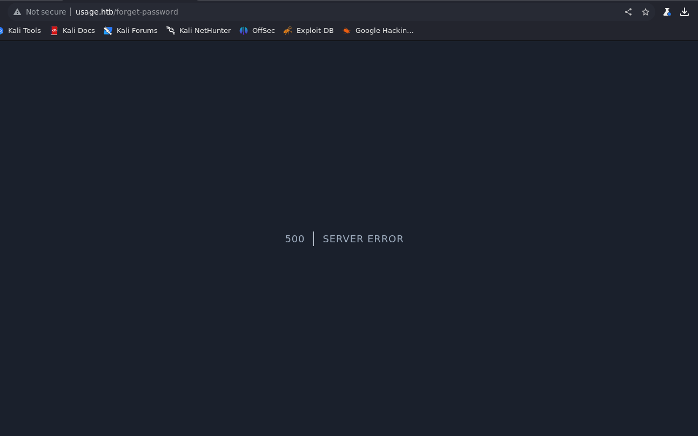



## Exploitation Phase

Employing Burp Suite, we intercept requests to the password reset feature, revealing HTTP POST requests.

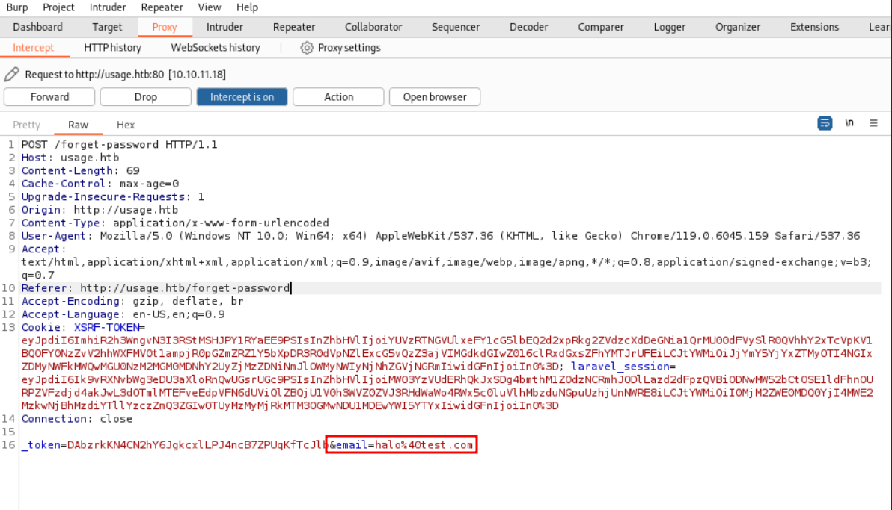

Utilizing SQLMap, we automate the injection process by **providing the intercepted request in a text file** and execute the following command:

```bash
sqlmap -r request.txt -p email --level 5 --risk 3 --batch --threads 10 --dbs
```

This yields a successful exploitation, divulging the presence of a MySQL database and facilitating further exploration.

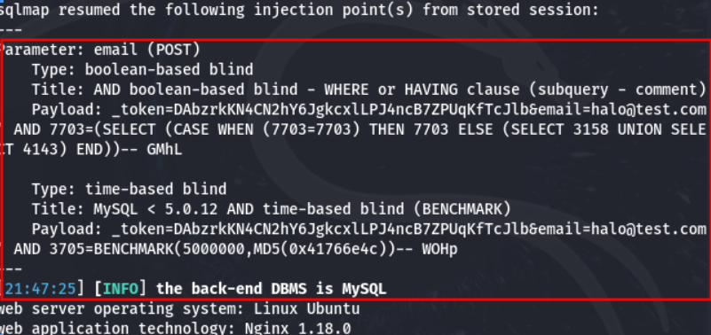

sqlmap results



## Database Exploitation

We proceed to extract database information using SQLMap, obtaining a list of databases, including “usage\_blog.”

```bash
sqlmap -r request.txt -p email --level 5 --risk 3 --threads 10 -D database_name --tables
```

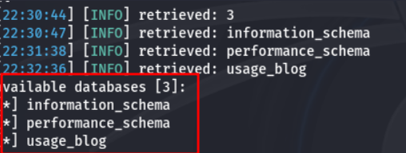

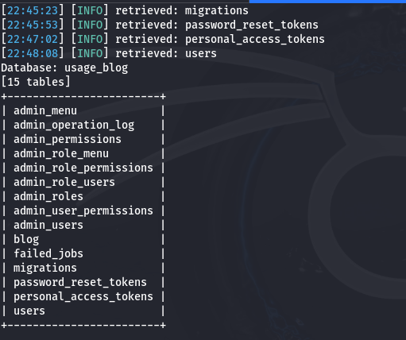

Continuing our reconnaissance, we extract table information and subsequently retrieve data from the “admin\_users” table.


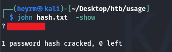

```bash
john hash.txt --wordlist=/usr/share/wordlists/rockyou.txt -show
```

Alternatively, you can use:

```bash
john hash.txt -show
```



## User Credentials and Dashboard Access

With obtained credentials, we gain access to the admin dashboard, unveiling insights into the web application’s technologies and versions.

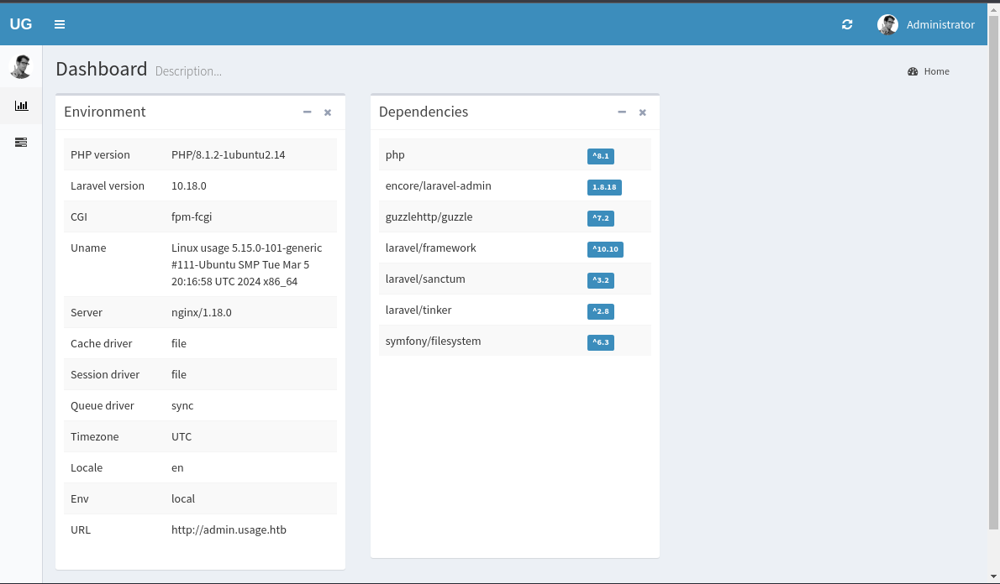

Further investigation unveils a potential vulnerability associated with the profile picture upload feature, leading us to exploit it by uploading a PHP reverse shell payload.

[**CVE-2023-24249 : An arbitrary file upload vulnerability in laravel-admin v1.8.19 allows attackers…CVE-2023-24249 : An arbitrary file upload vulnerability in laravel-admin v1.8.19 allows attackers to execute arbitrary…**](https://www.cvedetails.com/cve/CVE-2023-24249/?source=post_page-----16397895490f--------------------------------)

```bash
nc -lvnp [port]
```

Once the reverse shell setup is complete, proceed with the file upload process. Intercept the upload request using Burp Suite to modify the file name back to “.php.jpg.php”. This manipulation ensures that the web server recognizes the uploaded file as a PHP script and executes the reverse shell payload accordingly.

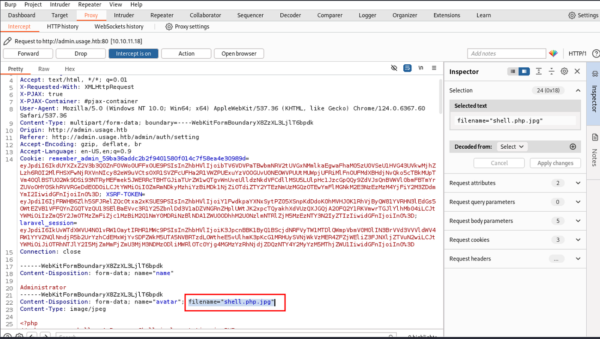

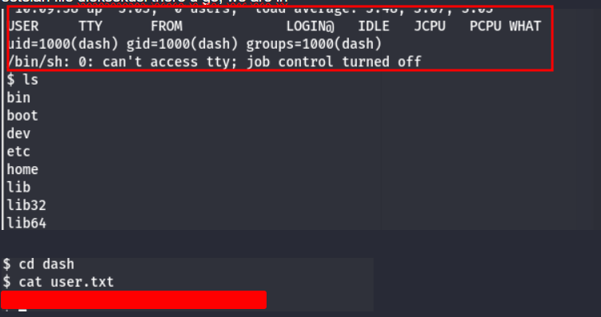



## Privilege Escalation Exploration

After uncovering the user flag, our curiosity drives us to delve deeper into the user’s dashboard. Among the intriguing findings, one item piques our interest: the “.monitrc” file. Intrigued by its contents, I decide to explore further, hoping to uncover something of significance.

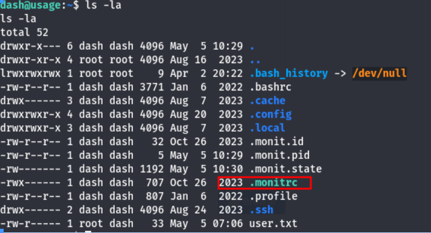

Upon examining the “.monitrc” file, I notice something intriguing. Eager to explore its implications, I opt to initiate an SSH connection to user Xander based on the insights gleaned from the “.monitrc”.

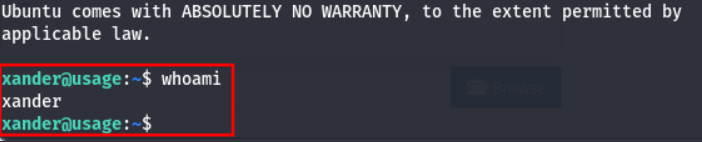


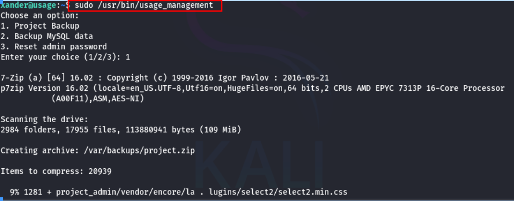

Exploring the options within, I focus on the “Project Backup” option. Despite the limited information provided, I recall that this is a custom website. Thus, I decide to explore its default directories, starting with “/var/www/html”.

As our objective is to elevate privileges to root, acquiring the “id\_rsa” file becomes imperative. To achieve this, I execute the following commands within the “/var/www/html” directory:

```bash
touch @id_rsa
ln -s /root/.ssh/id_rsa id_rsa
```

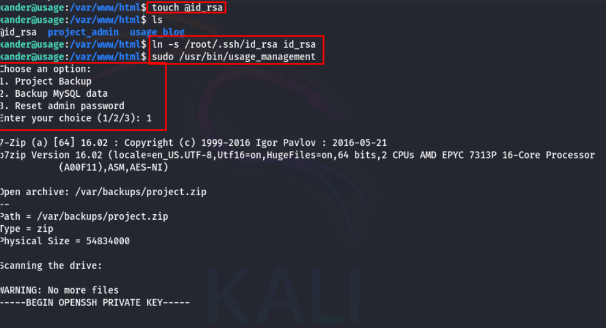

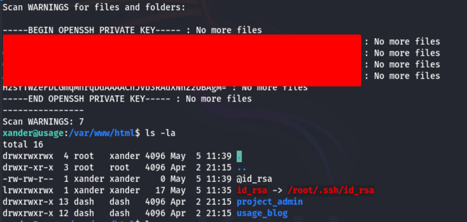



## Root Access

Upon obtaining the SSH private key, the next step is exploitation. Here, I copy the hash portion of the private key and save it in my original directory as “id\_rsa”.

Next, I adjust the permissions of the “id\_rsa” file to ensure its confidentiality and integrity:

```bash
chmod 600 id_rsa
```

With the necessary permissions granted, I proceed to establish an SSH connection using the obtained private key:

```bash
ssh -i id_rsa root@IP
```

This command initiates an SSH connection to the target system, utilizing the “id\_rsa” private key for authentication.

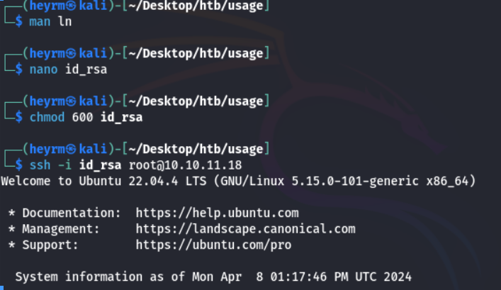

and we are in.




